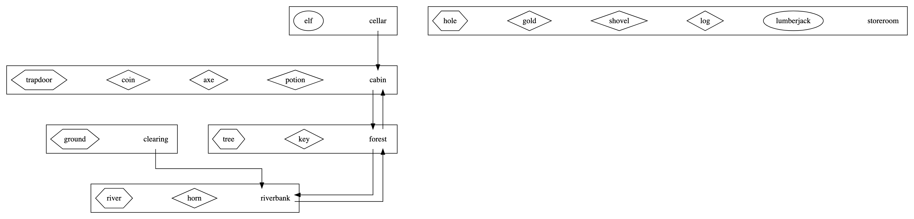

# TextBasedGameEngine
## Introduction
A simple multi-player text-based adventure game engine in Java. 
To run the server from the command line `mvnw exec:java@server`. 
To run the client that will connect to the server `mvnw exec:java@client -Dexec.args="XXXX"`, replace XXXX with your username.
## Features
### 1. Basic Commands
- "inventory" (or "inv" for short): lists all of the artefacts currently being carried by the player
- "get": picks up a specified artefact from the current location and adds it into player's inventory
- "drop": puts down an artefact from player's inventory and places it into the current location
- "goto": moves the player to the specified location (if there is a path to that location)
- "look": prints names and descriptions of entities in the current location and lists paths to other locations

Note that in addition to these standard "built-in" commands, it is possible to customise a game with a number of additional game actions which will be introduced later. Of course, built-in commands are reserved words and therefore **CANNOT** be used as names for any other elements of the command language.
### 2. Game Entities
Game entities are a fundamental building block of any text adventure game.
Entities represent a range of different "things" that exist within a game which is defined in a [.dot file](https://github.com/Eumenides-K/TextBasedGameEngine/blob/main/config/extended-entities.dot).
The different types of entity represented in the game are as follows:

- Locations: Rooms or places within the game
- Artefacts: Physical things within the game that can be collected by the player
- Furniture: Physical things that are an integral part of a location
(these **CANNOT** be collected by the player)
- Characters: The various creatures or people involved in game
- Players: A special kind of character that represents the user in the game

The picture below shows how an example set of game entites work:

### 3. Game Actions
In addition to the standard "built-in" commands (e.g. `get`, `goto`, `look` etc.), the game engine can also
respond to any of a number of game-specific commands (as specified in the [.xml file](https://github.com/Eumenides-K/TextBasedGameEngine/blob/main/config/extended-actions.xml)).
Each of these actions will have the following elements:

- One or more possible _trigger_ phrases (ANY of which can be used to initiate the action)
- One or more _subject_ entities that are acted upon (ALL of which need to be available to perform the action)
- An optional set of _consumed_ entities that are all removed ("eaten up") by the action
- An optional set of _produced_ entities that are all created ("generated") by the action
- A _narration_ that provides a human-readable explanation of what happened when the action is performed
### 4. Command Flexibility
**Case Insensitivity**  
All commands (including entity names, locations, built in commands and action triggers) are treated as case-insensitive.

**Decorated Commands**  
In order to support variability, the server is able to cope with _additional_ "decorative" words being inserted into a command.
For example, the basic command `chop tree with axe` might be entered by the user as `please chop the tree using the axe`.
Both versions are equivalent and both are accepted by the command interpreter.

**Word Ordering**  
The ordering of the words in a command does not affect the server's ability to find appropriate matching actions.
For example `chop tree with axe` and `use axe to chop tree` are equivalent and both are accepted by the command interpreter.

**Partial Commands**  
To further support flexible natural language communication, the server is able to operate with shortened, "partial" commands.
It is convenient for the user to be able to omit _some_ of the subjects from a command, whilst still providing enough information for the correct action to be identified.
For example, the command `unlock trapdoor with key` could alternatively be entered as _either_ `unlock trapdoor` _or_ `unlock with key` - both of which provide enough detail for an action match to be attempted.
In order to stand a chance of matching a command to an action, each incoming command **MUST** contain a trigger phrase and _at least_ one subject.
Anything less than this and the intended action will probably be too vague to identify.

**Extraneous Entities**  
When searching for an action, the server will match **ALL** of the subjects that are specified in the incoming command (e.g. `repair door with hammer and nails`).
Extraneous entities included within an incoming command (i.e. entities that are in the incoming command, but not specified in the action file) will prevent a match from being made. This is to prevent the user from attempting to perform actions with inappropriate entities
(e.g. `open potion with hammer` is not supposed to succeed).

**Ambiguous Commands**  
If a particular command is ambiguous (i.e. there is _more than one_ **valid** and **performable** action possible - given the current state of the game) then **NO** action should be performed and a warning message is sent back to the user

**Composite Commands**  
Composite commands (commands involving more than one activity) are be supported.
Users are unable to use commands such as `get axe and coin`, `get key and open door` or `open door and potion`.
A single command can only be used to perform a single built-in command or a single game action.
## License
[MIT license](https://github.com/Eumenides-K/TextBasedGameEngine/blob/main/LICENSE) 
[See alse](https://github.com/drslock/JAVA2022/tree/main/Weekly%20Workbooks/10%20Briefing%20on%20STAG%20assignment)

